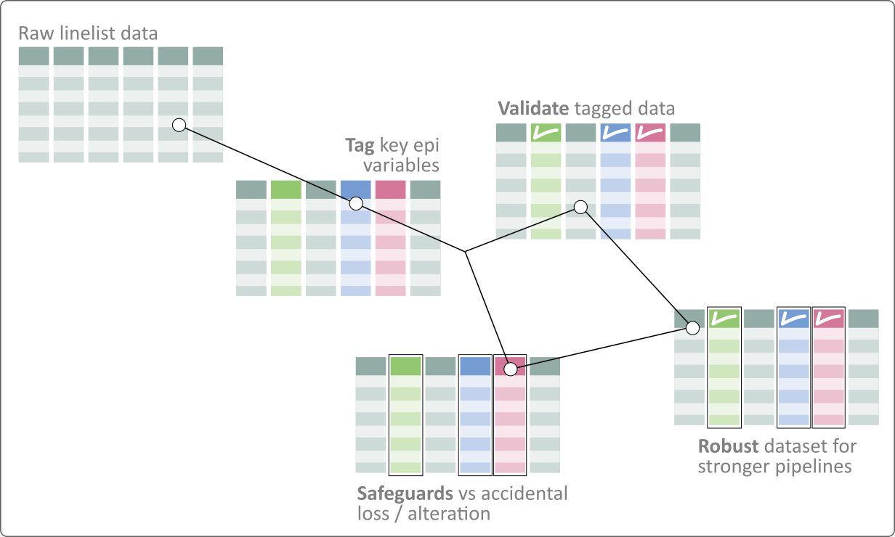
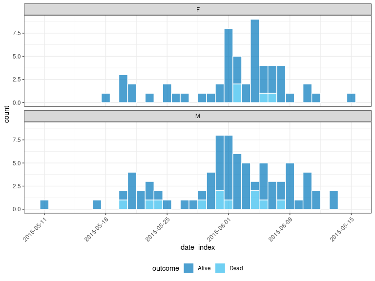

<!-- README.md is generated from README.Rmd. Please edit that file -->

# **linelist**: Tagging and Validating Epidemiological Data 

<!-- badges: start -->

[](https://www.digitalpublicgoods.net/r/linelist)
[](https://opensource.org/license/mit)
[](https://cran.r-project.org/web/checks/check_results_linelist.html)
[](https://github.com/epiverse-trace/linelist/actions)
[](https://app.codecov.io/gh/epiverse-trace/linelist)
[](https://www.reconverse.org/lifecycle.html#maturing)
[](https://cran.r-project.org/package=linelist)
[](https://cran.r-project.org/package=linelist)
[](https://doi.org/10.5281/zenodo.6532786)
<!-- badges: end -->

*linelist* provides a safe entry point to the *Epiverse* software
ecosystem, adding a foundational layer through *tagging*, *validation*,
and *safeguarding* epidemiological data, to help make data pipelines
more straightforward and robust.

## Installation

### Stable version

Our stable versions are released on CRAN, and can be installed using:

``` r
install.packages("linelist", build_vignettes = TRUE)
```

<div class="pkgdown-devel">

### Development version

The development version of linelist can be installed from
[GitHub](https://github.com/) with:

``` r
if (!require(pak)) {
  install.packages("pak")
}
pak::pak("epiverse-trace/linelist")
```

</div>

## Usage

``` r

```


linelist works by tagging key epidemiological data in a `data.frame` or
a `tibble` to facilitate and strengthen data pipelines. The resulting
object is a `linelist` object, which extends `data.frame` (or `tibble`)
by providing three types of features:

1.  a **tagging system** to identify key data, enabling access to these
    data using their tags rather than actual names, which may change
    over time and across datasets

2.  **validation** of the tagged variables (making sure they are present
    and of the right type/class)

3.  **safeguards** against accidental losses of tagged variables in
    common data handling operations

The short example below illustrates these different features. See the
[Documentation](#documentation) section for more in-depth examples and
details about `linelist` objects.

``` r
# load packages and a dataset for the example
# -------------------------------------------
library(linelist)
library(dplyr)
#> 
#> Attaching package: 'dplyr'
#> The following objects are masked from 'package:stats':
#> 
#>     filter, lag
#> The following objects are masked from 'package:base':
#> 
#>     intersect, setdiff, setequal, union

dataset <- outbreaks::mers_korea_2015$linelist
head(dataset)
#>     id age age_class sex        place_infect reporting_ctry
#> 1 SK_1  68     60-69   M         Middle East    South Korea
#> 2 SK_2  63     60-69   F Outside Middle East    South Korea
#> 3 SK_3  76     70-79   M Outside Middle East    South Korea
#> 4 SK_4  46     40-49   F Outside Middle East    South Korea
#> 5 SK_5  50     50-59   M Outside Middle East    South Korea
#> 6 SK_6  71     70-79   M Outside Middle East    South Korea
#>                                              loc_hosp   dt_onset  dt_report
#> 1 Pyeongtaek St. Mary, Hospital, Pyeongtaek, Gyeonggi 2015-05-11 2015-05-19
#> 2 Pyeongtaek St. Mary, Hospital, Pyeongtaek, Gyeonggi 2015-05-18 2015-05-20
#> 3 Pyeongtaek St. Mary, Hospital, Pyeongtaek, Gyeonggi 2015-05-20 2015-05-20
#> 4 Pyeongtaek St. Mary, Hospital, Pyeongtaek, Gyeonggi 2015-05-25 2015-05-26
#> 5                           365 Yeollin Clinic, Seoul 2015-05-25 2015-05-27
#> 6 Pyeongtaek St. Mary, Hospital, Pyeongtaek, Gyeonggi 2015-05-24 2015-05-28
#>   week_report dt_start_exp dt_end_exp    dt_diag outcome   dt_death
#> 1     2015_21   2015-04-18 2015-05-04 2015-05-20   Alive       <NA>
#> 2     2015_21   2015-05-15 2015-05-20 2015-05-20   Alive       <NA>
#> 3     2015_21   2015-05-16 2015-05-16 2015-05-21    Dead 2015-06-04
#> 4     2015_22   2015-05-16 2015-05-20 2015-05-26   Alive       <NA>
#> 5     2015_22   2015-05-17 2015-05-17 2015-05-26   Alive       <NA>
#> 6     2015_22   2015-05-15 2015-05-17 2015-05-28    Dead 2015-06-01

# check known tagged variables
# ----------------------------
tags_names()
#>  [1] "id"             "date_onset"     "date_reporting" "date_admission"
#>  [5] "date_discharge" "date_outcome"   "date_death"     "gender"        
#>  [9] "age"            "location"       "occupation"     "hcw"           
#> [13] "outcome"

# build a linelist
# ----------------
x <- dataset %>%
  tibble() %>%
  make_linelist(
    date_onset = "dt_onset", # date of onset
    date_reporting = "dt_report", # date of reporting
    occupation = "age" # mistake
  )
x
#> 
#> // linelist object
#> # A tibble: 162 × 15
#>    id      age age_class sex   place_infect   reporting_ctry loc_hosp dt_onset  
#>    <chr> <int> <chr>     <fct> <fct>          <fct>          <fct>    <date>    
#>  1 SK_1     68 60-69     M     Middle East    South Korea    Pyeongt… 2015-05-11
#>  2 SK_2     63 60-69     F     Outside Middl… South Korea    Pyeongt… 2015-05-18
#>  3 SK_3     76 70-79     M     Outside Middl… South Korea    Pyeongt… 2015-05-20
#>  4 SK_4     46 40-49     F     Outside Middl… South Korea    Pyeongt… 2015-05-25
#>  5 SK_5     50 50-59     M     Outside Middl… South Korea    365 Yeo… 2015-05-25
#>  6 SK_6     71 70-79     M     Outside Middl… South Korea    Pyeongt… 2015-05-24
#>  7 SK_7     28 20-29     F     Outside Middl… South Korea    Pyeongt… 2015-05-21
#>  8 SK_8     46 40-49     F     Outside Middl… South Korea    Seoul C… 2015-05-26
#>  9 SK_9     56 50-59     M     Outside Middl… South Korea    Pyeongt… NA        
#> 10 SK_10    44 40-49     M     Outside Middl… China          Pyeongt… 2015-05-21
#> # ℹ 152 more rows
#> # ℹ 7 more variables: dt_report <date>, week_report <fct>, dt_start_exp <date>,
#> #   dt_end_exp <date>, dt_diag <date>, outcome <fct>, dt_death <date>
#> 
#> // tags: date_onset:dt_onset, date_reporting:dt_report, occupation:age
tags(x) # check available tags
#> $date_onset
#> [1] "dt_onset"
#> 
#> $date_reporting
#> [1] "dt_report"
#> 
#> $occupation
#> [1] "age"
```

`validate_linelist()` will error if one of your tagged column doesn’t
have the correct type:

``` r
# validation of tagged variables
# ------------------------------
## (this flags a likely mistake: occupation should not be an integer)
validate_linelist(x)
#> Error: Some tags have the wrong class:
#>   - occupation: Must inherit from class 'character'/'factor', but has class 'integer'
```

``` r
# change tags: fix mistakes, add new ones
# ---------------------------------------
x <- x %>%
  set_tags(
    occupation = NULL, # tag removal
    gender = "sex", # new tag
    outcome = "outcome"
  )

# safeguards against actions losing tags
# --------------------------------------
## attemping to remove geographical info but removing dates by mistake
x_no_geo <- x %>%
  select(-(5:8))
#> Warning: The following tags have lost their variable:
#>  date_onset:dt_onset
```

For stronger pipelines, you can even trigger errors upon loss:

``` r
lost_tags_action("error")
#> Lost tags will now issue an error.

x_no_geo <- x %>%
  select(-(5:8))
#> Error: The following tags have lost their variable:
#>  date_onset:dt_onset

x_no_geo <- x %>%
  select(-(5:7))

## to revert to default behaviour (warning upon error)
lost_tags_action()
#> Lost tags will now issue a warning.
```

Alternatively, content can be accessed by tags:

``` r
x_no_geo %>%
  select(has_tag(c("date_onset", "outcome")))
#> Warning: The following tags have lost their variable:
#>  date_reporting:dt_report, gender:sex
#> 
#> // linelist object
#> # A tibble: 162 × 2
#>    dt_onset   outcome
#>    <date>     <fct>  
#>  1 2015-05-11 Alive  
#>  2 2015-05-18 Alive  
#>  3 2015-05-20 Dead   
#>  4 2015-05-25 Alive  
#>  5 2015-05-25 Alive  
#>  6 2015-05-24 Dead   
#>  7 2015-05-21 Alive  
#>  8 2015-05-26 Alive  
#>  9 NA         Alive  
#> 10 2015-05-21 Alive  
#> # ℹ 152 more rows
#> 
#> // tags: date_onset:dt_onset, outcome:outcome

x_no_geo %>%
  tags_df()
#> # A tibble: 162 × 4
#>    date_onset date_reporting gender outcome
#>    <date>     <date>         <fct>  <fct>  
#>  1 2015-05-11 2015-05-19     M      Alive  
#>  2 2015-05-18 2015-05-20     F      Alive  
#>  3 2015-05-20 2015-05-20     M      Dead   
#>  4 2015-05-25 2015-05-26     F      Alive  
#>  5 2015-05-25 2015-05-27     M      Alive  
#>  6 2015-05-24 2015-05-28     M      Dead   
#>  7 2015-05-21 2015-05-28     F      Alive  
#>  8 2015-05-26 2015-05-29     F      Alive  
#>  9 NA         2015-05-29     M      Alive  
#> 10 2015-05-21 2015-05-29     M      Alive  
#> # ℹ 152 more rows
```

linelist can also be connected to the incidence2 package for pipelines
focused on aggregated count data:

``` r
library(incidence2)
#> Loading required package: grates

x_no_geo %>%
  tags_df() %>%
  incidence("date_onset", groups = c("gender", "outcome")) %>%
  plot(
    fill = "outcome",
    angle = 45,
    nrow = 2,
    border_colour = "white",
    legend = "bottom"
  )
```



## Documentation

More detailed documentation can be found at:
<https://epiverse-trace.github.io/linelist/>

In particular:

- [A general introduction to
  linelist](https://epiverse-trace.github.io/linelist/articles/linelist.html)

- [The reference
  manual](https://epiverse-trace.github.io/linelist/reference/index.html)

## Getting help

To ask questions or give us some feedback, please use the github
[issues](https://github.com/epiverse-trace/linelist/issues) system.

## Data privacy

Case line lists may contain personally identifiable information (PII).
While linelist provides a way to store this data in R, it does not
currently provide tools for data anonymization. The user is responsible
for respecting individual privacy and ensuring PII is handled with the
required level of confidentiality, in compliance with applicable laws
and regulations for storing and sharing PII.

Note that PII is rarely needed for common analytics tasks, so that in
many instances it may be advisable to remove PII from the data before
sharing them with analytics teams.

## Development

### Lifecycle

This package is currently *maturing*, as defined by the [RECON software
lifecycle](https://www.reconverse.org/lifecycle.html). This means that
essential features and mechanisms are present and stable but minor
breaking changes, or function renames may still occur sporadically.

### Contributions

Contributions are welcome via [pull
requests](https://github.com/epiverse-trace/linelist/pulls).

### Code of Conduct

Please note that the linelist project is released with a [Code of
Conduct](https://github.com/epiverse-trace/.github/blob/main/CODE_OF_CONDUCT.md).
By contributing to this project, you agree to abide by its terms.

### Notes

This package is a reboot of the RECON package
[linelist](https://github.com/reconhub/linelist). Unlike its
predecessor, the new package focuses on the implementation of a
`linelist` class. The data cleaning features of the original package
will eventually be re-implemented for `linelist` objects, albeit likely
in a separate package.
